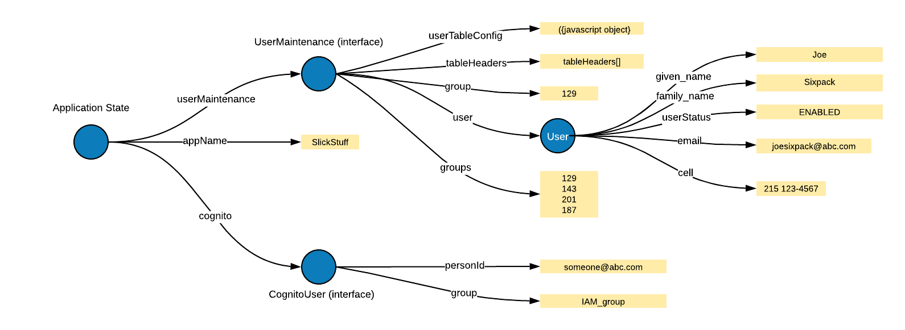
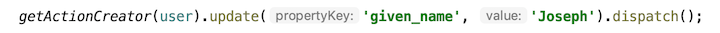
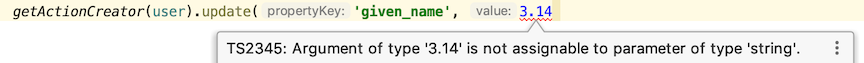

# Manifold-dx for React

## A TypeScript Implementation of Flux

The goal here is to provide a quick and easy developer experience, using Flux mechanics.  This TypeScript framework 
relies on developers to define application state based on interfaces, whose type information is then used to infer action ID's, 
action objects, action creators, and reducers.  So the only boilerplate you're writing are the strongly typed definitions that 
comes with any React project in TypeScript.

Where Redux's implementation is based on functional programming and immutability, manifold-dx uses TypeScript to define strongly
typed immutable structure, then uses generics and type inference to provide out-of-the-box API's for action creation, predefined 
reducers, dispatching, mapping state to components, dead simple middleware, and much more.

Since manifold-dx uses strongly typed nestable state objects, the actual shape of the application state can be whatever you want it 
to be, or whatever the problem requires.  A deeply nested hierarchy doesn't present any problem, and component updates are performed
efficiently.

As with Redux, be sure you actually need to use this.  Big standalone SPA's often need libraries to manage app state, others often do not.  

### How It Works

Let's say we have used TypeScript interfaces to define application state that looks like this:

  


Now suppose we want to update the user's given_name, from 'Joe' to 'Joseph' (the property on the top right).


  


So to make all this happen, you simply call API's that manifold-dx provides for you:

  


Just to reiterate, you didn't have to write anything, these API's are provided by the library:
- `getActionCreator` builds and invokes an action creator for you
- `update` defines the action according to what you put in (code completion and type-checking courtesy of TypeScript)
- `dispatch` updates application state and the UI

### What makes it easy

1. **TypeScript Generics** are a powerful feature, and we take full advantage of them, without requiring developers to know much about them.  We can write type-safe, generic updates, that enforce valid property names and value types.  
   
    1. The developer just calls a generic api, and gets all the IDE assistance you'd expect. 
       
    2. Also note that IDE's provide autocomplete for the property names, and flag property name misspellings.
    
2. **Strongly Typed Data Structures** 
    1. Developers often spend a lot of time figuring out what their application state should look like.
       Given that developers have defined their state, we just add in a couple properties in the nodes
       of their state graph (the blue circles in the diagrams above):
       1. `_parent` is the node that contains this one, or null if it the topmost node (application state)
       2. `_myPropname` is what my parent calls me, or an empty string if the topmost node (application state)
    2. Example - what initial state might look like 
    ```typescript jsx
    let user: UserState = {
      // properties of the StateObject
      // parent in the state application graph
      _parent: userMaintenance,
      // parent's name for this object, ie this === this._parent[this._myPropname]
      _myPropname: 'user',
      // raw data properties
      given_name: '',
      family_name: '',
      email: '',
      UserState: '',
      cell: ''
    }
    ```
    **In other words, the only thing a developer has to do is to add two properties to the nodes of their
    application state.**  This makes it easy for us to generate the property path (`'userMaintenance.user.given_name"`), 
    given only the node in the application state.
3. **Container Class Templates** Because you probably don't want to write Container classes from scratch all the time...
   - You can copy and past them from the project's "templates" directory, these are your 'smart' classes that delegate to 'dumb' renderers 
     - TemplateContainer.tsx, TemplateRenderProps.tsx, TemplateSimple.tsx
     - They contain some recommended patterns, including using FunctionComponents and React Hooks.
   - Just fill in your strongly typed interfaces and mappings and write your rendering functions/components.


### Demo App
- See the todo app at [https://github.com/mfsjr/manifold-dx-todo](https://github.com/mfsjr/manifold-dx-todo).
- Once you understand this, check out some more robust, scalable techniques provided in the sections below.

### To Install
- `npm i manifold-dx`   

### About application state
This is actually a more general question that applies to writing any UI, and it seems that the hard part is that there are a million ways to do it.  I'll outline here what has worked well, along with some helper interfaces that make sure that the objects we build agree with the interfaces we have defined.

1. State is comprised of:
    1. Nodes that are StateObjects
    2. Properties that are basic JS data types or plain objects
    3. Properties that are named (indexed by) strings
    4. No classes, class instances or functions
2. The main observation here is that state is dynamic so everything besides the top node (application state) itself is 
   usually optional (possibly undefined).  Whether we are waiting for async results or simply writing code line-by-line  state can 
   always be optional.
3. State Objects can always be obtained using optional chaining: `getStateObject(getAppStore().getState()?.uiLayout?.modal)`, 
   where the function will throw if the state object is undefined (action creators can use optional chaining too).
   1. You can also define accessors to return a real object, ie non-optionally, by throwing an exception if the object is 
      undefined.  So you can define accessors to grab state objects which do the checking once.
4. We provide helper intefaces that enforce parent child relationships.  They're easy to code and TypeScript will use them to 
   provide code completion and flag mistakes.

**Serialization** application state can be de/serialized using a library called JSOG, that extends JSON 
serialization to handle cyclic graphs.

- How to define AppState
```typescript jsx
export interface AppData {
  userMaintenance?: UserMaintenanceState;
  cognito?: AppCognitoState;
}

export interface AppState extends AppData, State<null> { }

export interface UserMaintenanceState extends UserMaintenance, State<AppState> {
  user?: GroupUserState;
  open: boolean;
}

export interface GroupUserState extends GroupUser, State<UserMaintenanceState> { }

export interface AppCognitoState extends AppCognitoState, State<AppState> { }  // phases of cognito login and person
```
- How to initialize AppState
```typescript jsx
export class AppStateCreator {
  appState: AppState;

  constructor() {
    this.appState = {
      _parent: null,
      _myPropname: '',
    };
    this.appState.cognito = {
      _parent: this.appState,
      _myPropname: 'cognito',
      groups: []
    };
    this.appState.userMaintenance = {
      _myPropname: 'userMaintenance',
      _parent: this.appState,
      groups: [],
      user_in_groups: [],
      users: [],
    };
    this.appState.userMaintenance.user = {
      _parent: this.appState.userMaintenance,
      _myPropname: 'user',
      family_name: '',
      given_name: '',
      email: '',
      cell: '',
      UserStatus: '',
      open: false
    };
  }
}
```  
- How to hook up AppState to manifold-dx.  Note that we define mutation checking for development, so if anything other than an action modifies our state, we fail fast with a descriptive error.
```typescript jsx
export class AppStore extends Store<AppState> {

  constructor(_appData: AppState, _configOptions: StateConfigOptions) {
    super(_appData, _configOptions);
    // process.env[`REACT_APP_STATE_MUTATION_CHECKING`] = 'true';
    let strictMode: boolean = process.env.REACT_APP_STATE_MUTATION_CHECKING ?
      process.env.REACT_APP_STATE_MUTATION_CHECKING === 'true' :
      false;
    let detection = this.getManager().getActionProcessorAPI().isMutationCheckingEnabled();
    console.log(`strictMode = ${strictMode}, mutation detection=${detection}`);
  }
}

let appStore = new AppStore(new AppStateCreator().appState, {});

export const getAppStore = (): AppStore => appStore;
```  
- How to access application state: optional chaining using the `getStateObject` method.

  Since application state is dynamic, it is generally declared to be optional or unioned with 'undefined'.
  So, optional chaining can be used to get state objects.
  
  However, after the app is initialized, app state objects have usually been created, and verifying 
  that they are actually defined is cumbersome.  In other words, after your app is initialized, state has 
  usually been created, and your code usually assumes it exists (and it usually does).
  
  So manifold-dx supplies api's that expect that state objects have been created, are declared as 
  such (non-optional, never undefined), failing fast by throwing an error.
  
  This allows you to use optional chaining to access state objects deterministically.
```typescript
// access app state using optional chaining
const message: string = getStateObject(getAppStore().getState()?.uiLayout?.modal).message; // throws if uiLayour or modal is undefined
// or use it when creating actions
getActionCreator(getAppStore().getState()?.uiLayout?.modal).set('message', 'Your updates have been saved').dispatch(); // throws if uiLayout isundefined
```
- How to integrate with React Router v4 and up
  - You can integrate routing with state management using RedirectDx [https://github.com/mfsjr/manifold-dx-redirect-dx]
  - So you can define actions to navigate to app URL's using predetermined properties, like so
```typescript jsx
getActionCreator(getAppStore().getState()?.uiLayout).set('redirectTo', SceneUrl.MY_GROUP).dispatch(); 
```
  
### Mapping state to components
In manifold-dx, components are lightweight classes that invoke renderers (usually functions) and create mappings between application state and renderers.  
1. RenderPropComponent is the preferred container, where the renderer function (view) is passed in via props
2. ContainerComponent passes the renderer (view) into the constructor, or overrides the render method itself

Both of these classes require the developer to write two functions:
1. `appendToMappingActions(mappingActions: AnyMappingAction[]): void;` This is how we define the relationship
   between state and the renderer's properties, so that when an action changes state, the renderer's props are updated and the component re-renders.
2. `createViewProps(): VP;` is the function that initializes the view properties used by the renderer.

Here is a simple example of mapping state (a property called 'message') to a component a view property called 'alertMessage':
```typescript jsx
export class Alert extends RenderPropsComponent<AlertProps, AlertViewProps, AppState> {

  constructor(_props: AlertProps) {
    super(_props, getAppStore().getState());
  }

  protected appendToMappingActions(mappingActions: AnyMappingAction[]): void {
    mappingActions.push(
      getMappingActionCreator(getAppStore().getState()?.uiLayout?.modal, 'message').createPropertyMappingAction(this, 'alertMessage')
    );
  }

  createViewProps(): AlertViewProps {
    let alertMessage = getStateObject(getAppStore().getState()?.uiLayout?.modal).message || '';
    return {
      alertMessage,
      handleClickClose: handleClickClose
    };
  }
}
```

### Key Features
- You may have noticed above, where the action contains both the old and the new value.  This allows actions to be
  'unapplied', like a database transaction log, allowing us to do time-travel.
- **Mutation Checking**, will throw errors if state is mutated by anything other than actions (careful - development only!).
  This is controlled by the environment variable REACT_APP_STATE_MUTATION_CHECKING.
- **Simple, Powerful Middleware** - optional developer-provided functions can be invoked at various times in the lifecycle.
  i.e., before reducers (state changes) or after components are updated (or both).

  **Middleware Lifecycle:**
     1. **dispatch** - is available via actions or store:
        - `getActionCreator(stateObject).set('modalMessage', 'You cannot use the Admin UI');`
        - `store.dispatch(action1, action2, ...actionN);`
     2. **preProcessor** - optionally execute code before anything changes, can read all actions, allow them to pass, or replace them
        - `getAppStore().getManager().getActionProcessorAPI().appendPreProcessor(myPreProessor);`
     3. **reducer** - You don't write reducers, manifold-dx invokes its own generic reducers that get called for you.
     4. **actionPostReducer** - optionally added to specific actions when something needs to be done immediately after a state change, e.g.
       - `scoreAppendAction.actionPostReducer = () => { /* recalculate average score here */ }`
     5. **containerPostReducer** - optionally added to mapping actions, invoked by the container when the state in the mapping action is updated. 
         Using the previous example, if we don't want to have to remember to update the average, let's put the average in the component
         and use the optional containerPostReducer by appending the argument function 'this.calcAverage':
        - `actions.push( bowlingMapper.createPropertyMappingAction(this, 'scores', this.calcAverage.bind(this)) );`
     6. **postProcessor** - optionally execute code after state has updated, but immediately before component renders invoked (which are async)
        - See the logging example below
     7. **render** - invoked for you by manifold-dx when app state changes, all containers mapped to the changed state will be rendered
        - multiple state changes are de-duped so only there's only one render per container component (although React 
          may re-render repeatedly)
        
- **ActionLoggingObject** interface to log actions before they change anything (or after)
  ```typescript
    let logging: string[] = [];
    let loggerObject: ActionLoggingObject = actionLogging(logging, false);
    getAppStore().getManager().getActionProcessorAPI().appendPreProcessor(loggerObject.processor);
  ```
- **Action Type Guards** are provided as convenience methods, since all actions pass through Processor 
  middleware, where you often want to find specific kinds of actions.

  There are a lot of things you might want to do, like performing transforms on data that are state dependent, 
  or like below, using `action.isStatePropChange` to validate whether the user can perform specific actions.
  Note that if you need to you can replace the inbound actions with whatever other actions may be needed.
    ```typescript
    import { userIsAdmin } from '../auth';  // your app defines this
    import { createStore } from '../store'; // your app defines this
    const store = createStore(); 
    const actionValidator: ActionProcessorFunctionType = // actions: Action[] => Action[]
      actions => {
        const stateObject = getStateObject(store.getState());
        for(let i = 0; i < actions.length; i++) {
          const action = actions[i];
          if (action.isStatePropChange() && action.parent === stateObject && 
            action.propertyName === 'redirectTo' &&  action.value === '/admin/secret/ui' && !userIsAdmin()) {
              const replacementAction = getActionCreator(stateObject).set('modalMessage', 'You cannot use the Admin UI');
              return [replacementAction];
          }      
        }
        return actions;
      };
    store.getManager().getActionProcessorAPI().appendPreProcessor(actionValidator);
    ```
  - **'set' API** a convenience method that will do insert, update or delete depending on old and new data values.
  - **React Router (v4+) integration** via RedirectDx [https://github.com/mfsjr/manifold-dx-redirect-dx]

### Prior Art
Obviously Redux has been our frame of reference, but Vuex should be mentioned as it influenced this design in a couple of ways:
- State is modified synchronously, although in our case async aspects should be handled elsewhere (separation of concerns).
- Since state is global, we have no need for declarative/nested access, we just declare it globally, eg:
	`export const appStore = new AppStore(new AppStateCreator().appState, {});`

Also note, a coincidental similarity with Vuex is a somewhat nested/compositional approach to state, as opposed to 
Redux's preferred 'flat' shape.

**To Run Tests:** `npm test --runInBand REACT_APP_STATE_MUTATION_CHECKING=true` 
- `runInBand` since we need to have tests execute in order
- and we want REACT_APP_STATE_MUTATION_CHECKING on when testing or debugging.
  - this will also turn on state diff output, when mutations are detected
   
#### Recent releases
##### v1.1.27
- remove recompose
- more README updates
##### v1.1.25
- Action instance type guard methods to facilitate easier use of ProcessorAPI's (see above)
  - isStatePropChange, isStateArrayChange, isMappingChange
- Improved test coverage: added unit tests
  - removed unused code
  - fixed (successfully executing) non-terminating unit test
- Un- or rarely-used API's:
    - one minor fix,
    - renamings to avoid confusion
##### v1.1.24
- Enhancing usability, optional chaining
- Generic type-safe accessor
  - `const name = getStateObject(store.getAppState()?.name);`
- Keeping up to date with recent TypeScript and React releases
    
    
#### Future Work
- Dev tools for action replay (time travel)
