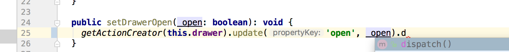

# Manifold-dx for React

Simplified state management, based on new approaches to providing 
unidirectional predictability, and a great development experience 
with mutation checking, type safety from TypeScript, and 'time-travel'.

Ok, what are these so-called "new approaches"?

1. **You don't code actions or reducers, you call Action API's**

   The obvious advantages here are that developers don't have to code 
   anything, and the API is fully tested.
   
   Actions are implemented as pure invertible functions, so they may 
   be performed, undone or redone easily, all through the API.
   
   Another less obvious advantage is mutation detection.  Since only 
   the API changes state, out-of-the-box change detection catches any 
   accidental mutations a developer may cause (for example, if the 
   developer is accessing state directly to compute other properties).
   
1. **State can mutate, but React data is immutable.  Every piece of state 
   can be expressed as a unique key, so deeply nested state graphs 
   have a 'flat' representation.**
   
   App state is a single store of "state objects", which are mutable plain 
   javascript objects.  They contain the immutable data that React 
   uses, or other state objects, so you can have deeply nested state.  
   The Action API's keep it all straight for you.
   
      
   State objects can figure out their path in the state object graph, 
   so every property in the state object graph can be expressed uniquely
   by its path, and managed as if it were flat, in a simple map.
   
   So in the example above, state objects can figure out that the 
   bowler's city can be accessed at {Application State}.bowler.address.city.
   
1. **TypeScript is used to define your state, which allows the ActionAPI's
   to be aware of what properties are available and what their data types
   are.  This allows IDE's to present you with the right parameter choices 
   and flag incorrect values.**
   
   Most state management frameworks related to React have been 
   retrofitted with TypeScript, but not taken full advantage of it.
   
   
   
   *The net result is that when you define your state with TypeScript, you've
   already defined all the actions that can be performed: insert, update or
   delete on any property, which is uniquely identifiable within the state graph.  
   There's no need to invent actions coupled to reducers
   that you have to write, because its already in a generic API that wraps itself 
   around the application state that you've defined.  All you have to do is call it, 
   and TypeScript helps your IDE provide all the assistance you would expect 
   using a strongly typed API (valid arguments, type-checked values, etc).*
   
**Features:**
- Predictable, synchronous single-store state management with pure invertible functions,
  including time-travel.
- Type-safe action API eliminates need to code either actions or reducers, simply call API
- Immutable React data
- Mutable state 
- Configurable mutation checking for development and testing   
- Simplified middleware - functions that receive actions, can be ordered before or after 
  actions are performed.
- State can always be represented by a flat mapping, regardless of how deeply nested.
   
**To Install:**
`npm install --save manifold-dx`   
   
**Demo:**
See the todo app at [https://github.com/mfsjr/manifold-dx-todo](https://github.com/mfsjr/manifold-dx-todo). 

**Run Tests:** `npm test --runInBand REACT_APP_STATE_MUTATION_CHECKING=true` 
- `runInBand` since we need to have tests execute in order
- and we want REACT_APP_STATE_MUTATION_CHECKING on when testing or debugging.
  - this will also turn on state diff output, when mutations are detected

##### What's Next
- Build optimizations
- Larger, real-world example applications

##### TL;DR What's in a name?
Manifolds exist in engineering and mathematics and describe certain 
geometries, in our case pertaining to object graphs and the modifications we 
make to them, as well as the effects they have on reducing the code that 
developers are required to write, while needing fewer accompanying libraries:

"The concept of a manifold is central to many parts of geometry and modern 
mathematical physics because it allows complicated structures to be described 
and understood in terms of the simpler local topological properties of Euclidean 
space. Manifolds naturally arise as solution sets of systems of equations 
and as graphs of functions." - Wikipedia

Appending 'dx' to the name is intended to convey that its a framework 
that deals with dynamic changes, as well as giving a nod to Redux, 
the excellent de-facto standard that was used as a reference, 
along with complimentary libraries that have been enthusiastically 
built up around it.

### This is BETA software!!!  
There are no known problems but its very 'green'.

